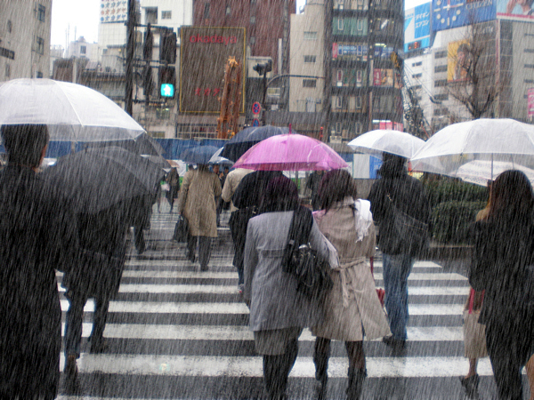
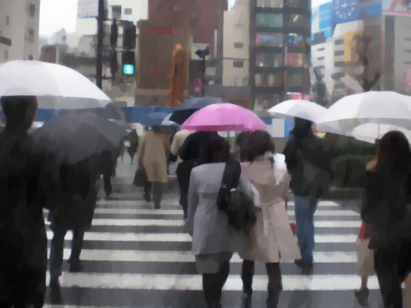

## Total variation , python3 implement ...
refer to https://github.com/WanglifuCV/TotalVariationAlgorithms/blob/master/TVdenoise.m

Denoising/smoothing a given image y with the isotropic total variation.

total variation algorithm tends to be over-smoothed with missing fine image details

raw rainy image:

  

after iter=200,

  
